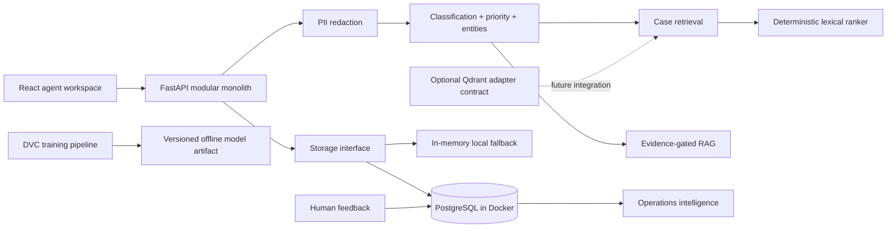

# TelcoAssist

A working portfolio prototype of an AI-assisted support intelligence platform for telecom customer service teams.

[](https://github.com/barissolcay/telecom-support-intelligence/actions/workflows/ci.yml)
[](https://github.com/barissolcay/telecom-support-intelligence/actions/workflows/codeql.yml)
[](https://barissolcay.github.io/telecom-support-intelligence/)
[](https://github.com/barissolcay/telecom-support-intelligence/releases)
[](LICENSE)

TelcoAssist helps human support agents understand, prioritize, and resolve telecom tickets with grounded evidence. It combines deterministic ticket intelligence, rule-aware priority prediction, privacy processing, case retrieval, citation-aware knowledge retrieval, feedback, and operational analytics in one review-first workflow.

> All tickets, customers, documents, and evaluation results in this repository are synthetic. The application does not perform customer actions or send messages automatically.

## Product tour


The demo covers the complete agent loop: open a ticket, inspect redacted customer context, review classification and priority signals, compare resolved cases, request grounded guidance, prepare a reply, and record feedback or a resolution.

### Live showcase

Open the [interactive TelcoAssist demo](https://barissolcay.github.io/telecom-support-intelligence/). The hosted showcase uses synthetic in-browser fallback data so every product screen remains explorable without credentials or customer systems. Run Docker Compose locally for the API-backed workflow.

## Features

- Deterministic Turkish and English runtime classification plus an offline TF-IDF + Logistic Regression candidate
- Rule engine plus model signals for priority prediction
- Deterministic PII redaction before downstream processing
- Structured summaries, entities, follow-up questions, and decision signals
- Deterministic lexical demo retrieval plus a tested Qdrant hybrid-query adapter contract
- Citation-aware RAG with active-document filtering and insufficient-evidence refusal
- Agent inbox, three-column ticket workspace, response drafting, and resolution capture
- Knowledge lifecycle management and indexing visibility
- Operations dashboard with statistical incident signals and AI adoption metrics
- PostgreSQL-backed ticket, message, resolution, and feedback persistence in Docker
- Synthetic data pipeline, group-aware evaluation, DVC stages, Docker Compose, and CI

## Architecture



The V1 is a modular monolith: domain boundaries remain explicit without adding network failure modes between small services. Docker Compose uses PostgreSQL for the working ticket lifecycle. Local development defaults to an in-memory repository, and the GitHub Pages showcase uses in-browser synthetic state. Qdrant is an optional adapter contract rather than an active dependency of the demo path.

### Runtime scope

| Capability | API-backed Docker demo | GitHub Pages showcase |
| --- | --- | --- |
| Ticket, message, resolution, feedback storage | PostgreSQL | Browser session only |
| Classification | Deterministic taxonomy baseline | Versioned fixture outputs |
| Case and knowledge retrieval | Deterministic lexical ranker | Versioned fixture outputs |
| TF-IDF + Logistic Regression | Offline evaluated candidate | Metrics view only |
| Qdrant | Adapter contract; not active by default | Not used |

## Quick start

### Docker

```bash
docker compose up --build
```

Compose works without a local `.env` file and applies its PostgreSQL settings explicitly. Copy
`.env.example` only when you want to customize the remaining application settings.

Open the web application at `http://localhost:8080` and API documentation at `http://localhost:8000/docs`.

The optional Qdrant adapter sandbox can be started separately with `docker compose --profile adapter up qdrant`; it is not wired into the default demo request path.

### Local development

```bash
python -m venv .venv
source .venv/bin/activate  # Windows: .venv\Scripts\activate
pip install -e ".[dev]"
npm --prefix apps/web install
make dev
```

For training-only environments, install the smaller `.[ml]` extra instead of the full development toolchain.

Run checks with:

```bash
make test
make evaluate
```

## API surface

| Method | Endpoint | Purpose |
| --- | --- | --- |
| `POST` | `/api/v1/tickets` | Create and privacy-process a ticket |
| `PATCH` | `/api/v1/tickets/{id}` | Update assignment or workflow status |
| `POST` | `/api/v1/tickets/{id}/messages` | Save a redacted agent/system message |
| `POST` | `/api/v1/tickets/{id}/analyze` | Run structured ticket intelligence |
| `GET` | `/api/v1/tickets/{id}/similar-cases` | Retrieve resolved cases with filters |
| `POST` | `/api/v1/copilot/query` | Return evidence-gated guidance |
| `POST` | `/api/v1/feedback` | Store human feedback |
| `POST` | `/api/v1/tickets/{id}/resolve` | Save a structured resolution |
| `GET` | `/api/v1/analytics/dashboard` | Calculate operations metrics |
| `GET` | `/health`, `/ready` | Liveness and dependency readiness |

## Evaluation results

Results are generated from the versioned synthetic evaluation set by `make evaluate`; the report files under `reports/` are the source of truth. Metrics must not be interpreted as performance on real operator data.

| Component | Metric | Measured | Gate | Evaluation scope |
| --- | --- | ---: | ---: | --- |
| Offline ticket classifier | Macro F1 | 1.00 | ≥ 0.85 | 600 held-out synthetic records |
| Priority rules | Macro F1 | 1.00 | ≥ 0.75 | 7 safety/regression fixtures |
| PII masking | Recall | 1.00 | ≥ 0.95 | 6 labeled positive fixtures |
| Similar-case retrieval | Recall@5 | 1.00 | ≥ 0.85 | 4 synthetic queries |
| Similar-case retrieval | MRR | 1.00 | ≥ 0.75 | 4 synthetic queries |
| Grounded response | Citation correctness | 1.00 | ≥ 0.90 | 3 answer + 1 refusal fixtures |
| Grounded response | Unsupported claim rate | 0.00 | ≤ 0.05 | 3 answer fixtures |

These values come from small, controlled synthetic fixtures and intentionally separable template groups. They validate pipeline regressions, not generalization to real customer language. Perfect fixture scores are reported with their sample sizes to avoid implying production model quality.

## Screenshots

| Agent workspace | Operations intelligence |
| --- | --- |
|  |  |
| Grounded copilot | Knowledge lifecycle |
|  |  |

## Security and privacy

- Raw and redacted content are separate concepts; only redacted content enters AI services.
- Phone numbers, e-mail addresses, IP addresses, MAC addresses, national IDs, subscriber references, and card-like values are masked with conversation-stable placeholders.
- Document types and file sizes are allow-listed.
- Deprecated knowledge is excluded by default; retrieved text is treated as data, never as instructions.
- Secrets remain server-side and are configured through environment variables.
- Low-confidence classification requires review and no customer response is sent automatically.

See [privacy](docs/privacy.md), [security policy](SECURITY.md), and [architecture](docs/architecture.md) for details.

## Limitations

- The repository uses synthetic telecom scenarios and synthetic operating baselines.
- Demo retrieval uses a deterministic local implementation; the Qdrant adapter is a tested integration boundary, not a completed production path.
- The API runtime uses a deterministic taxonomy baseline. The TF-IDF classifier is an offline candidate and is not loaded by the demo API.
- No speech transcription, operator provisioning integration, packet inspection, or automatic customer messaging is included.
- Incident signals use rolling statistical thresholds, not causal network diagnosis.
- Every recommendation requires agent review.

## Documentation

- [Product requirements](docs/product-requirements.md)
- [Architecture](docs/architecture.md)
- [Data card](docs/data-card.md)
- [Model card](docs/model-card.md)
- [Evaluation](docs/evaluation.md)
- [Privacy](docs/privacy.md)
- [Limitations](docs/limitations.md)
- [Five-minute reviewer guide](docs/reviewer-guide.md)

## License

MIT — see [LICENSE](LICENSE).
