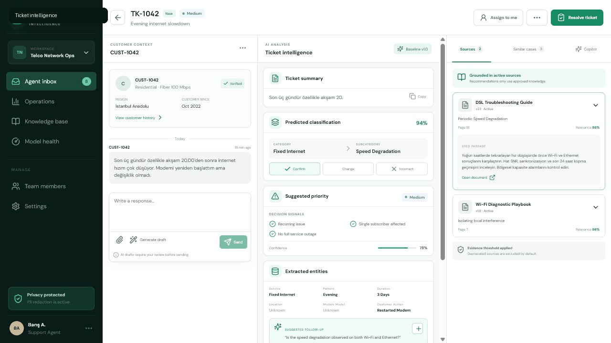
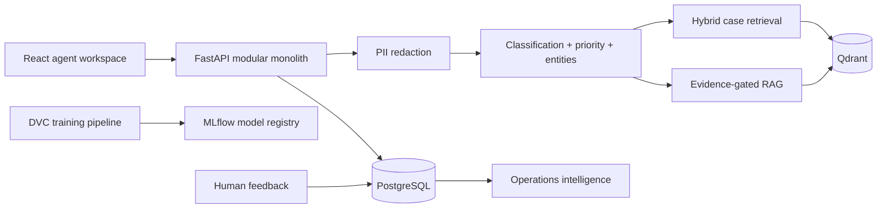
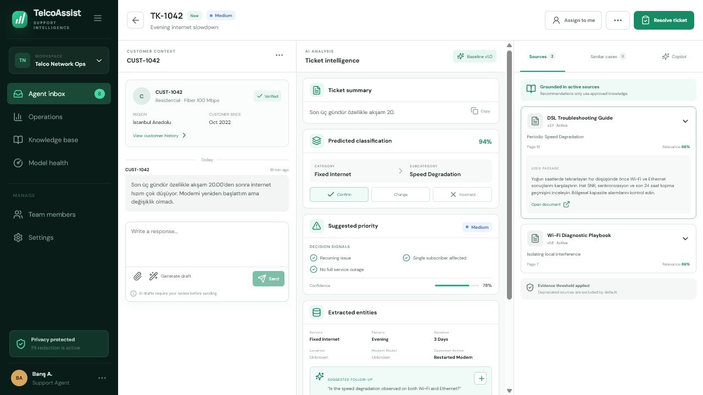
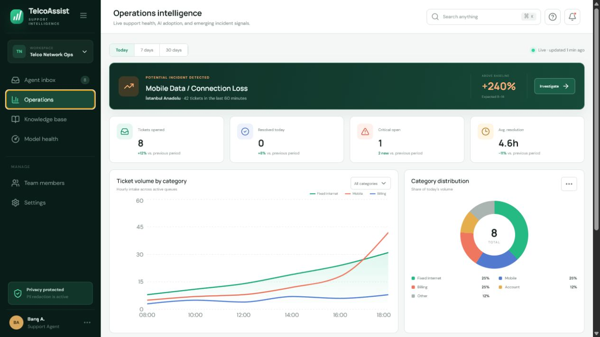
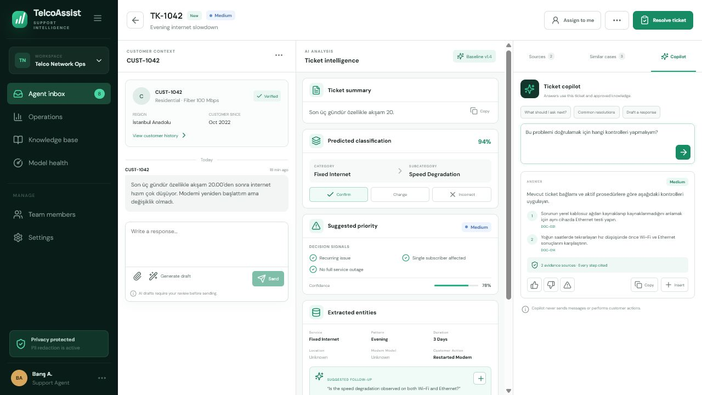
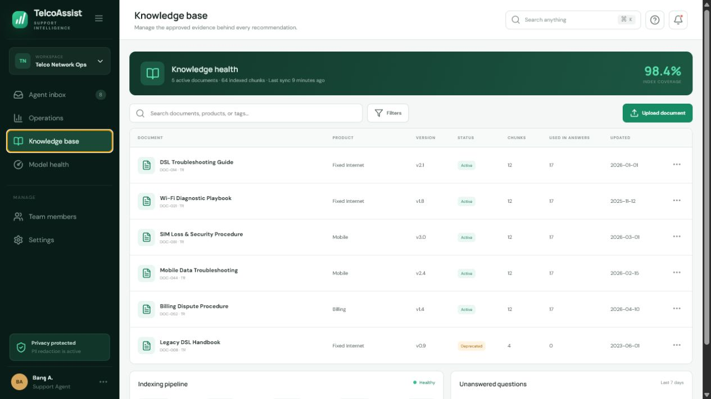

# TelcoAssist

An end-to-end AI copilot and support intelligence platform for telecom customer service teams.

[](https://github.com/barissolcay/telecom-support-intelligence/actions/workflows/ci.yml)
[](https://github.com/barissolcay/telecom-support-intelligence/actions/workflows/codeql.yml)
[](https://barissolcay.github.io/telecom-support-intelligence/)
[](https://github.com/barissolcay/telecom-support-intelligence/releases)
[](LICENSE)

TelcoAssist helps human support agents understand, prioritize, and resolve telecom tickets with grounded evidence. It combines hierarchical ticket classification, rule-aware priority prediction, privacy processing, hybrid case retrieval, citation-aware knowledge retrieval, feedback, and operational analytics in one review-first workflow.

> All tickets, customers, documents, and evaluation results in this repository are synthetic. The application does not perform customer actions or send messages automatically.

## Product tour



The demo covers the complete agent loop: open a ticket, inspect redacted customer context, review classification and priority signals, compare resolved cases, request grounded guidance, prepare a reply, and record feedback or a resolution.

### Live showcase

Open the [interactive TelcoAssist demo](https://barissolcay.github.io/telecom-support-intelligence/). The hosted showcase uses synthetic in-browser fallback data so every product screen remains explorable without credentials or customer systems. Run Docker Compose locally for the API-backed workflow.

## Features

- Hierarchical Turkish and English ticket classification with a TF-IDF + Logistic Regression baseline
- Rule engine plus model signals for priority prediction
- Deterministic PII redaction before downstream processing
- Structured summaries, entities, follow-up questions, and decision signals
- Hybrid dense/lexical retrieval contract with Qdrant-ready metadata filters
- Citation-aware RAG with active-document filtering and insufficient-evidence refusal
- Agent inbox, three-column ticket workspace, response drafting, and resolution capture
- Knowledge lifecycle management and indexing visibility
- Operations dashboard with statistical incident signals and AI adoption metrics
- Synthetic data pipeline, group-aware evaluation, DVC, MLflow configuration, Docker Compose, and CI

## Architecture



The V1 is a modular monolith: domain boundaries remain explicit without adding network failure modes between small services. PostgreSQL and Qdrant adapters are represented in deployment; the application can also boot in synthetic demo mode so that the interface remains reviewable when infrastructure is unavailable.

## Quick start

### Docker

```bash
cp .env.example .env
docker compose up --build
```

Open the web application at `http://localhost:8080`, API documentation at `http://localhost:8000/docs`, Qdrant at `http://localhost:6333/dashboard`, and MLflow at `http://localhost:5000`.

### Local development

```bash
python -m venv .venv
source .venv/bin/activate  # Windows: .venv\Scripts\activate
pip install -e ".[dev]"
npm --prefix apps/web install
make dev
```

Run checks with:

```bash
make test
make evaluate
```

## API surface

| Method | Endpoint | Purpose |
| --- | --- | --- |
| `POST` | `/api/v1/tickets` | Create and privacy-process a ticket |
| `POST` | `/api/v1/tickets/{id}/analyze` | Run structured ticket intelligence |
| `GET` | `/api/v1/tickets/{id}/similar-cases` | Retrieve resolved cases with filters |
| `POST` | `/api/v1/copilot/query` | Return evidence-gated guidance |
| `POST` | `/api/v1/feedback` | Store human feedback |
| `POST` | `/api/v1/tickets/{id}/resolve` | Save a structured resolution |
| `GET` | `/api/v1/analytics/dashboard` | Calculate operations metrics |
| `GET` | `/health`, `/ready` | Liveness and dependency readiness |

## Evaluation results

Results are generated from the versioned synthetic evaluation set by `make evaluate`; the report files under `reports/` are the source of truth. Metrics must not be interpreted as performance on real operator data.

| Component | Metric | Measured | Gate |
| --- | --- | ---: | ---: |
| Ticket classification | Macro F1 | 1.00 | ≥ 0.85 |
| Priority prediction | Macro F1 | 1.00 | ≥ 0.75 |
| PII masking | Recall | 1.00 | ≥ 0.95 |
| Similar-case retrieval | Recall@5 | 1.00 | ≥ 0.85 |
| Similar-case retrieval | MRR | 1.00 | ≥ 0.75 |
| RAG | Citation correctness | 1.00 | ≥ 0.90 |
| RAG | Unsupported claim rate | 0.00 | ≤ 0.05 |

These values come from the repository's controlled synthetic fixtures and intentionally separable template groups. They validate the pipeline and regression gates, not generalization to real customer language.

## Screenshots

| Agent workspace | Operations intelligence |
| --- | --- |
|  |  |
| Grounded copilot | Knowledge lifecycle |
|  |  |

## Security and privacy

- Raw and redacted content are separate concepts; only redacted content enters AI services.
- Phone numbers, e-mail addresses, IP addresses, MAC addresses, national IDs, subscriber references, and card-like values are masked with conversation-stable placeholders.
- Document types and file sizes are allow-listed.
- Deprecated knowledge is excluded by default; retrieved text is treated as data, never as instructions.
- Secrets remain server-side and are configured through environment variables.
- Low-confidence classification requires review and no customer response is sent automatically.

See [privacy](docs/privacy.md), [security policy](SECURITY.md), and [architecture](docs/architecture.md) for details.

## Limitations

- The repository uses synthetic telecom scenarios and synthetic operating baselines.
- Demo retrieval uses a deterministic local implementation; production deployment should enable the Qdrant adapter and evaluate embeddings on operator-approved data.
- The default classifier is CPU-oriented. An XLM-R comparison is documented but not required to run the product.
- No speech transcription, operator provisioning integration, packet inspection, or automatic customer messaging is included.
- Incident signals use rolling statistical thresholds, not causal network diagnosis.
- Every recommendation requires agent review.

## Documentation

- [Product requirements](docs/product-requirements.md)
- [Architecture](docs/architecture.md)
- [Data card](docs/data-card.md)
- [Model card](docs/model-card.md)
- [Evaluation](docs/evaluation.md)
- [Privacy](docs/privacy.md)
- [Limitations](docs/limitations.md)

## License

MIT — see [LICENSE](LICENSE).
